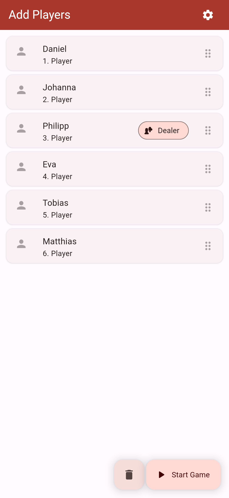
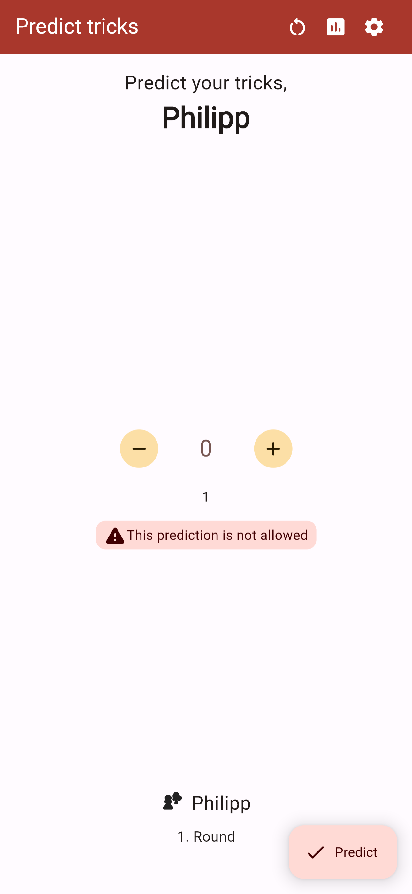
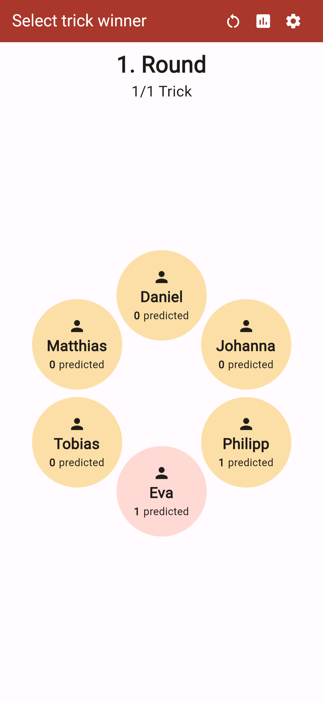
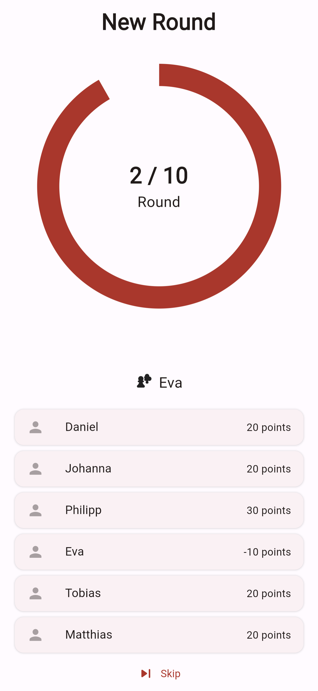
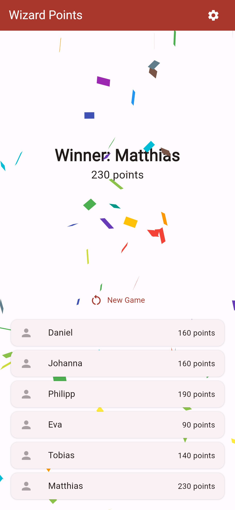
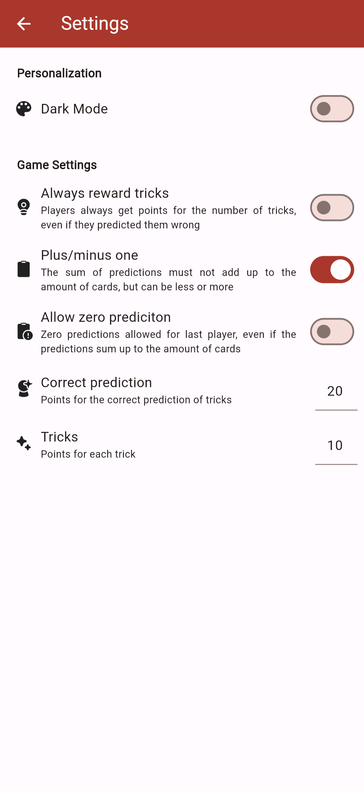

# Wizard Points

Wizard Points is a simple [web app](https://wizard-points.web.app/#/) that allows you to keep track of your points in the card game [Wizard](https://en.wikipedia.org/wiki/Wizard_(card_game)). 

Visit the [website](https://wizard-points.web.app/#/) to get started.

## Features

- Up to 6 players
- Keep track of dealer and player order
- Ajustable settings
    - Personalization
    - Game rules
- Intuitive and simple UI

## Screenshots

